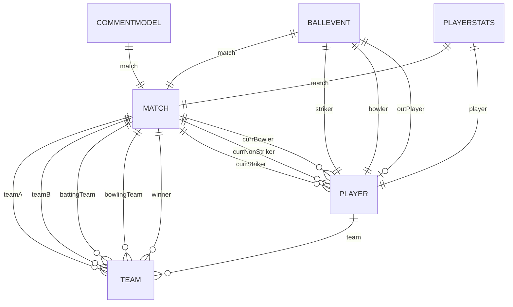
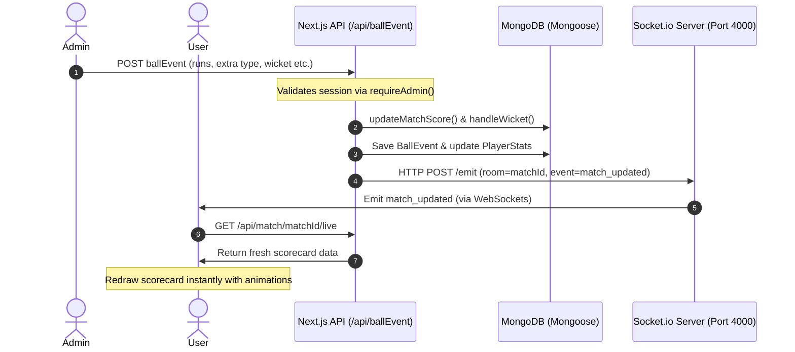

# CricPulse Project Architecture Documentation

CricPulse is a sports scorecard and live scoring system built on **Next.js 16 (App Router)**, **TypeScript**, **TailwindCSS**, **MongoDB/Mongoose**, and **Socket.io**. It is divided into an administrative dashboard for match management/ball-by-ball scoring, and a dark-themed public interface for fans to track matches in realtime.

---

## 📂 Folder Structure

```
CricPulse/
├── app/                  # Next.js App Router root
│   ├── (user)/           # Public client routes (Dashboard, Match detail, Team/Player lists)
│   ├── admin/            # Administrative console (Login, Matches dashboard, Scoring console)
│   ├── api/              # Backend endpoints (RESTful routing for teams, players, matches, events)
│   ├── globals.css       # Main stylesheet and design tokens
│   ├── layout.tsx        # Shell layout
│   └── middleware.ts     # Admin cookies checkpoint
├── components/           # Reusable UI Elements (Modals, Tables, Badge, Inputs, TeamLogo)
├── context/              # React Context Providers
├── lib/                  # Backend utilities (MongoDB connectors, auth verification, scoring helpers)
│   └── helpers/          # Scoring event executors (updateMatchScore, handleWicket, finishMatch)
├── models/               # Mongoose DB schema definitions
├── public/               # Static web assets (logos, svg items)
├── socket/               # Standalone Socket.io express server module
└── types/                # Typescript interface models
```

---

## 🗄️ Models & Database Relationships



1. **Team (`models/Team.ts`)**:
   - `name`: string (unique, required)
   - `logo`: string (stores built-in presets like `bat-ball` or custom URLs/emojis)
2. **Player (`models/Player.ts`)**:
   - `name`: string (required)
   - `role`: string (Batsman, Bowler, All-Rounder, Wicket Keeper)
   - `team`: ObjectId (references `Team`)
3. **Match (`models/Match.ts`)**:
   - Stores game state (score, wickets, legalBalls, innings, target, overs, venue, dateTime, status: `Upcoming | Live | Ended`).
   - Keeps track of active participants (`currStriker`, `currNonStriker`, `currBowler`).
4. **BallEvent (`models/BallEvent.ts`)**:
   - Records each delivery chronologically.
   - Stores batsman runs, extras runs, ballType (`Normal | Wide | NoBall | Bye | LegBye`), wicket falls, wicketType (`Bowled | Caught | LBW | Run Out | Stumped | Hit Wicket`), outPlayer, and newBatsman.
5. **PlayerStats (`models/PlayerStats.ts`)**:
   - Records batting runs/balls faced and bowling overs/runs conceded/wickets taken for each player per match.
6. **CommentModel (`models/CommentModel.ts`)**:
   - Ball-by-ball written description feed logs.

---

## 🔗 Connection: Admin & User Applications

- **Database Shared State**: Both sides talk to the same MongoDB database through API endpoints, ensuring data integrity.
- **State Boundaries**:
  - **Admin App**: Authoritative. Modifies state via POST/PATCH/DELETE calls to `/api/team`, `/api/player`, `/api/match`, and `/api/ballEvent`. Protected by middleware.
  - **User App**: Read-only. Accesses GET routes like `/api/match/[id]/live` to display card dashboards. No interactive inputs can modify records.
- **Realtime Sync Channel**: When the admin posts a `BallEvent`, the backend notifies the Socket.io server. The socket server emits a `match_updated` broadcast to the user client, prompting immediate, spinner-free interface updates.

---

## ⚡ Live Scoring & Socket.io Flow



---

## 🏏 Match Lifecycle & Scoring Rules

1. **Creation**: Admin creates a match, selecting Team A, Team B, Toss Winner, Toss Decision (Bat/Bowl), Venue, and Overs limit. Status is set to `Upcoming`.
2. **Initialization**: When the match goes `Live`, the admin selects the opening batsmen (Striker, Non-Striker) and the opening bowler. This calls `PATCH /api/match` with action `initializePlayers`.
3. **Scoring Deliveries**:
   - **Normal Ball**: Increments team score, legalBalls count, bowler's balls, and batsman's runs/balls faced.
   - **Wide**: Adds 1 penalty run to score and extras, does not count as a legal ball.
   - **No Ball**: Adds 1 penalty run to score and extras, does not count as a legal ball. Batsman's balls faced increases by 1 (cricket rules). Runs hit off bat go to batsman.
   - **Byes & Leg Byes**: Count as legal balls. Runs scored go to extras, not the batsman.
   - **Wickets**: Increments match wickets count. If not a run out, credits wicket to bowler stats. Sets `isOut = true` on the batsman stats and requires selecting a `newBatsman`.
4. **Over Transition**: When `legalBalls % 6 === 0`, the strike swaps ends automatically. The admin is prompted to select a `newBowler` (a bowler cannot bowl consecutive overs).
5. **Innings Transition**: If wickets reach 10 or legal balls reach `overs * 6`:
   - **First Innings**: Target is set to `score + 1`. Teams swap batting/bowling roles. Innings becomes `2`. Scoring variables reset.
   - **Second Innings**: Match ends immediately if `score >= target`, `wickets === 10`, or overs run out.
6. **Finalization**: `finishMatch` calculates the winner based on whether the target was chased successfully, updating match status to `Ended`.

---

## 💡 Important Design Decisions

- **Offline-Ready Font Assets**: Removed dynamic Google Font network loaders that cause Turbopack compiling failures in restricted sandboxes. Configured native CSS system font fallbacks (`Plus Jakarta Sans`, `Geist Mono`) for reliable rendering.
- **Inline SVG Logo Presets**: Handled branding and club assets locally via inline React SVG elements. This eliminates reliance on remote image links, ensuring loading speeds and offline compatibility.
- **Bypass Middleware on Login**: Added path exclusions inside `middleware.ts` for `/admin/login` to prevent infinite redirection loops on unauthorized connections.
- **Consolidated Row-Level Clicks**: Overhauled navigation by making match cards and table rows clickable, reducing button clutter.
